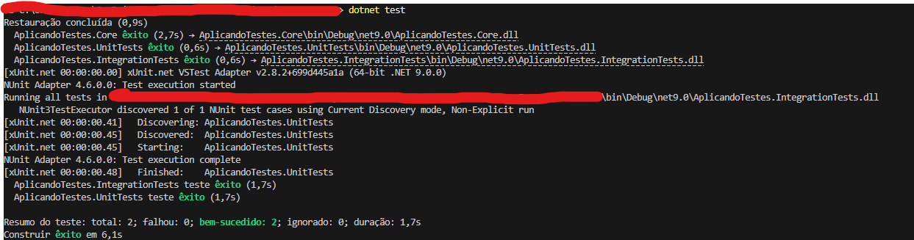
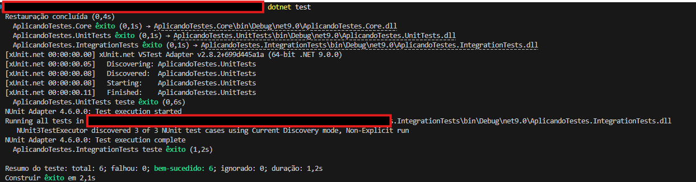
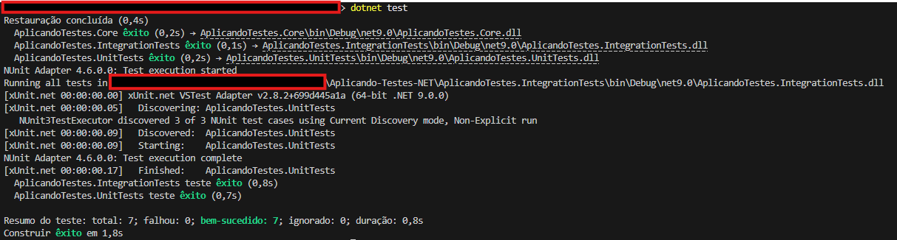

# Aplicando Testes

Este repositório foi criado para demonstrar a aplicação prática de **Testes Unitários**, **Testes de Integração** e **Testes com Mock** usando .NET 5. O objetivo é mostrar o que aprendi sobre testes automatizados e como diferentes tipos de validações podem ser utilizados no desenvolvimento de software.


## Testes Unitários (xUnit)

Nessa parte, implementei testes unitários usando o framework **xUnit**. A ideia dos testes unitários é validar métodos isolados da aplicação. Eu criei uma classe chamada `ConversorTemperatura` no projeto principal, que tem um método para converter temperaturas de Fahrenheit para Celsius.

Depois, no projeto de testes, escrevi dois cenários usando o atributo `[Theory]` com `[InlineData]` para testar diferentes entradas e saídas.

### Cenários Testados
1. **Entrada**: `32°F` -> **Saída Esperada**: `0°C`.
2. **Entrada**: `212°F` -> **Saída Esperada**: `100°C`.

### Código do Teste
```
using Xunit;
using AplicandoTestes.Core;

namespace AplicandoTestes.UnitTests
{
    public class ConversorTemperaturaTests
    {
        [Theory]
        [InlineData(32, 0)]
        [InlineData(212, 100)]
        public void FahrenheitParaCelsius_DeveRetornarResultadoCorreto(double f, double esperado)
        {
            double resultado = ConversorTemperatura.FahrenheitParaCelsius(f);
            Assert.Equal(esperado, resultado);
        }
    }
}
```

### Saída no Terminal:


## Testes de Integração (NUnit)

Depois dos testes unitários, passei para os testes de integração usando o NUnit. Nesse caso, a ideia foi validar o mesmo método de conversão de temperaturas, mas considerando cenários mais detalhados (como arredondamento).

Usei o atributo `[TestCase]` para criar múltiplos cenários. Além disso, utilizei `Assert.That` com `Is.EqualTo(...).Within(0.01)` para garantir que os valores estavam corretos dentro de uma margem de erro.

Cenários Testados
- **Entrada**: `47°F` -> **Saída Esperada**: `8.33°C`.
- **Entrada**: `86°F` -> **Saída Esperada**: `30°C`.

### Código do Teste

```
using NUnit.Framework;
using AplicandoTestes.Core;

namespace AplicandoTestes.IntegrationTests
{
    public class ConversorTemperaturaIntegrationTests
    {
        [TestCase(47, 8.33)]
        [TestCase(86, 30)]
        public void TestarConversaoTemperatura(double f, double esperado)
        {
            double resultado = ConversorTemperatura.FahrenheitParaCelsius(f);

            // Validando resultado dentro de uma margem de erro
            Assert.That(resultado, Is.EqualTo(esperado).Within(0.01));
        }
    }
}
```

### Saída no Terminal



## Testes com Mock (Moq + FluentAssertions)

Por último, implementei testes usando mock. Aqui, a ideia foi simular o comportamento de uma dependência sem precisar implementá-la de fato. Usei o framework `Moq` para criar o mock e o **FluentAssertions** para deixar as asserções mais claras e descritivas.

Criei uma interface `IConversor` com um método `Converter` para representar uma funcionalidade que poderia ser dependência de outro componente. O mock configurou o método `Converter` para retornar um valor específico em um cenário controlado.

Cenários Testados
- Simulei a entrada de `32°F` com o mock retornando `0°C` e verifiquei se o comportamento estava correto.

- Validei que o retorno do mock era consistente com o esperado.

```
using Moq;
using Xunit;
using FluentAssertions;

namespace AplicandoTestes.UnitTests
{
    public interface IConversor
    {
        double Converter(double tempF);
    }

    public class MockTests
    {
        [Fact]
        public void Conversor_DeveRetornarValorEsperado()
        {
            var mock = new Mock<IConversor>();
            mock.Setup(m => m.Converter(32)).Returns(0);

            var resultado = mock.Object.Converter(32);

            resultado.Should().Be(0, "a conversão de 32°F para Celsius deve ser 0");
        }
    }
}
```

### Saída no Terminal:



## Conclusão
Foi interessante aplicar esses três tipos de testes porque deu para entender bem a diferença entre cada um:

- **Testes Unitários**: Foco no método individual.
- **Testes de Integração**: Validam a interação entre componentes, com cenários mais completos.
- **Testes com Mock**: Simulam comportamentos, sendo úteis quando não queremos ou não podemos usar implementações reais.